# IC Design

> Author : Benjamin142857
>
> Date : 2019-10-22
>
> [TOC]


## Lab 1

#### 一. 实验简述

不知道干嘛的


#### 二. 操作流程

- 终端下：

  ```bash
  # 打开至lab1目录, 然后打印检查 .synopsys_dc.setup 的内容,不知道检查什么，也不知道干嘛的
  cat .synopsys_dc.setup
  
  # 打开Design Vision
  dv
  ```


* dv-UI 界面中，如无读入报错则进行以下操作
  * 点击 design -> compile design
  * 打开原理图，选中部件，右键 view schematic
  * 点击 design -> report design resources，查看部件被什么使用了
  * 点击 design -> Report area，查看面积报告
  * 点击 Timing -> Report Timing Path，查看时间报告
  * 点击 List -> Ports/Pin View -> All Ports，选中所有端口，然后点击 Attributes -> Optimization Constraints -> Timing Constrains 设置最大延时为1，然后再编译一边（design -> compile design） 


* 打印各种报告

  ~~~bash
  report_area
  report_timing
  report_power
  ~~~

  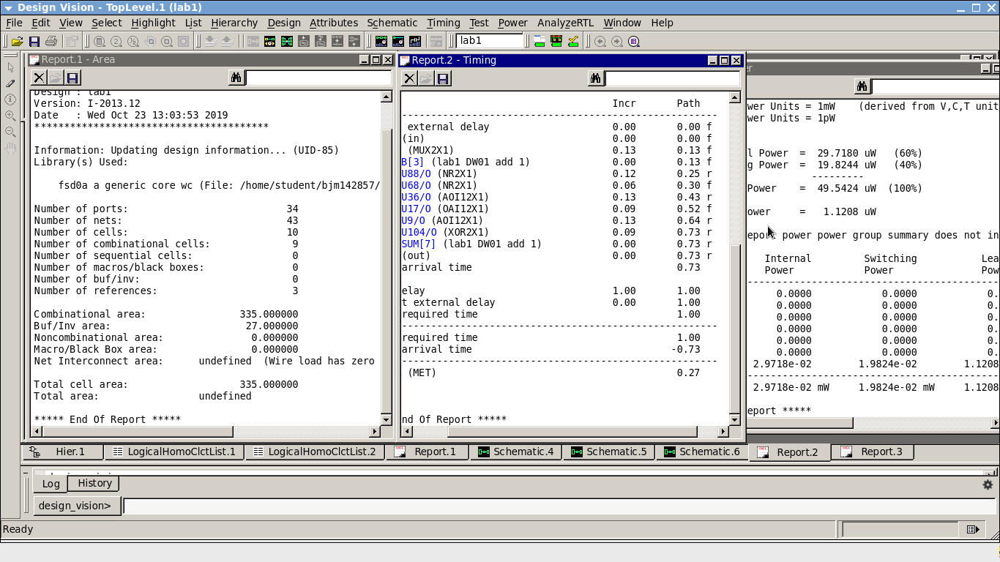

  


## Lab 2

### Lab 2-1 : Block Level Design

#### 一. 实验简述

* **微波炉时间控制系统**
  顶层设计包括三个块： microwave， timer 和 display。 microwave 包括一个状态机： micro_st.， 用以产生控制信号；
  和一个loader， 用以设定我们想加热的时间； cook_time[15:0]是对应timer的。timer在每个周期都.递减cook_timer，
  时间会在 7 段数码管显示出来。 随着时间减少到 0， LEDS 将会显示“done”， 以提醒加热的完成。


#### 二. 操作流程

* 终端下：

  ~~~bash
  # 打开至lab2-1目录, 然后打印检查 .synopsys_dc.setup 的内容,不知道检查什么，也不知道干嘛的
  cat .synopsys_dc.setup
  
  # 打开Design Vision
  dv
  ~~~


* 在 dv 启动后，dv内进行以下操作

  ~~~python
  # 点击 File -> setup, 设置几个 db 目录
  link library: fsd0a_a_generic_core_wc.db.db
  targer library: fod0a_b33_generic_io_wc.db
  symbol library: generic.sdb
      
  # 点击 File -> read, 读取pla文件
  文件类型选 All Files(.*)， 点击 converter.pla， 点打开
  
  # 点击  File -> Analyze –> Add
  选中 loader.v, microwave.v, micro_st.v, timer.v, top.v, display.v
  work选一个自定义目录如 "COOK_BJM"
  
  # 点击 File -> Elaborate
  库里面选择 "COOK_BJM" 在设计里面选择 "top(verilog)"
  ~~~

  

* 在 dv 命令行中输入一些指令

  ~~~bash
  # 设定操作条件
  set_operating_conditions –max WCCON –min BCCON
  
  # 点击 Attributes -> Operating Environment -> Wire Load 
  选中 G5K,点 OK
  
  # 设定时钟 clk
  create_clock -name clk -period 4  [get_ports clk] 
  set_dont_touch_network  [get_clocks clk]
  set_fix_hold            [get_clocks clk]
  set_clock_uncertainty       0.1   [get_clocks clk]
  set_clock_latency   -source 0     [get_clocks clk]
  set_clock_latency           1     [get_clocks clk] 
  ~~~

  

* 查看顶层设计视图 (选中top右键 -> Schematic View)

  


* 再在 dv 命令行中输入一些指令

  ~~~bash
  # 设定时钟端口的输入驱动长度
  set_driving_cell -library fsd0a_a_generic_core_wc -lib_cell BUFX4   -pin {O}  [get_ports clk]
  
  # 设定除了时钟之外的所有输入端口的驱动长度
  set_driving_cell -library fsd0a_a_generic_core_wc -lib_cell DFFX1   -pin {Q}  [remove_from_collection [all_inputs] [get_ports clk]]
  
  # 设定除数使能
  set_load  [load_of "fsd0a_a_generic_core_wc/DFFX1/D"]       [all_outputs]
  
  # 设置输入输出延时
  set_input_delay   -max 1    -clock clk   [all_inputs]
  set_input_delay   -min 0.2  -clock clk   [all_inputs]
  set_output_delay  -max 1    -clock clk   [all_outputs]
  set_output_delay  -min 0.1  -clock clk   [all_outputs]
  
  # 面积约束
  set_max_area        0
  set_max_fanout      2    [all_inputs]
  set_max_transition  0.3  [all_inputs]
  
  # 检查设计
  check_design –multiple_designs
  ~~~

  

* 检查后出现如图warning，接下来修改warning

  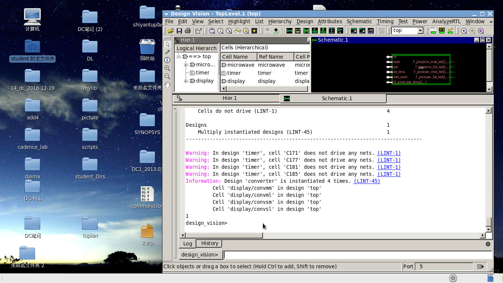

  选中 top， 在点击 Hierarchy -> Uniquify -> Hierarchy

  

* 编译报告

  * **设计报告**：Design -> Report Design		
  * **端口报告**：Design -> Report Port (click on verbose)
  * **时钟报告**：Design -> Report Clocks

  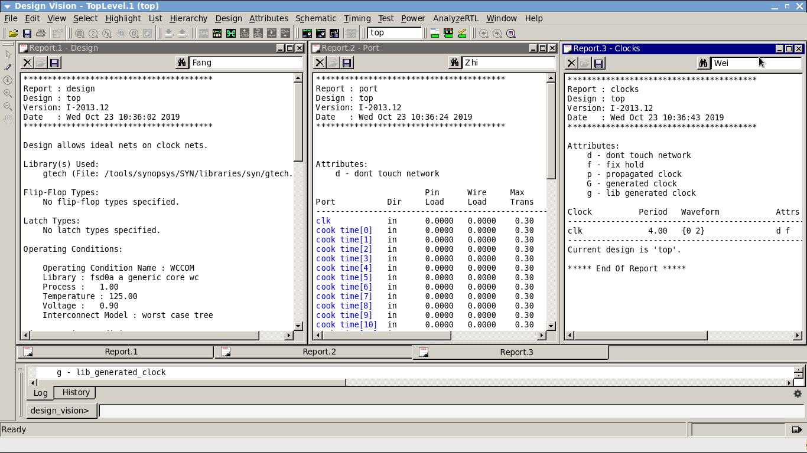


* 编译设计优化，dv中输入以下命令

  ~~~python
  compile -boundary_optimization -map_effort high -area_effort high
  ~~~

  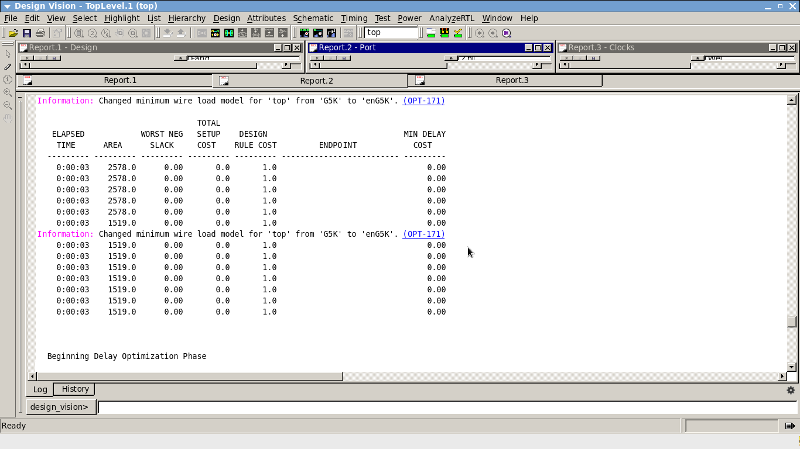


* 创建电路原理图

  * 点击 Create Design Schematic 

  

* 保存为 ddc

  ~~~python
  # 点击 File -> save as
  文件名：top_after_after_compile.ddc
  文件格式：DDC
  ~~~

  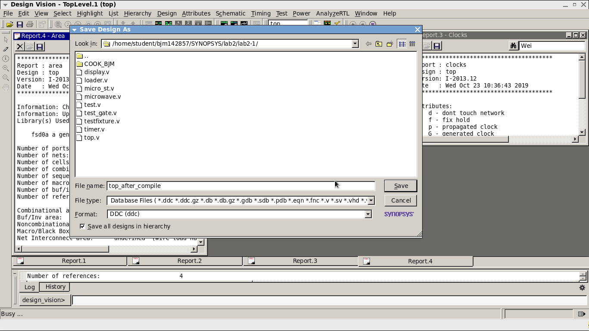


* 编译其他报告

  * **面积报告**：Design ->Report Area

  * **时间报告**：Timing -> Report Timing

  * **约束报告**： Design ->Report Constraints  (click on verbose)

    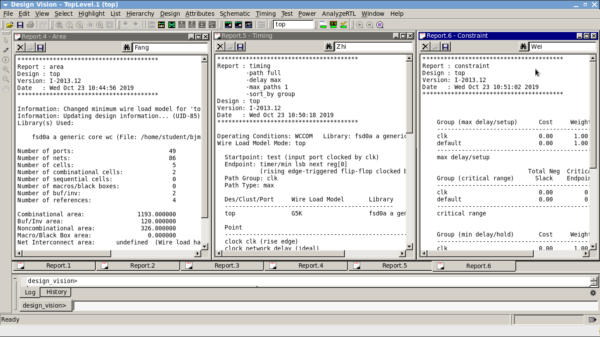

    

  * **多时间报告**：Timing -> Report Timing 并调以下参数

    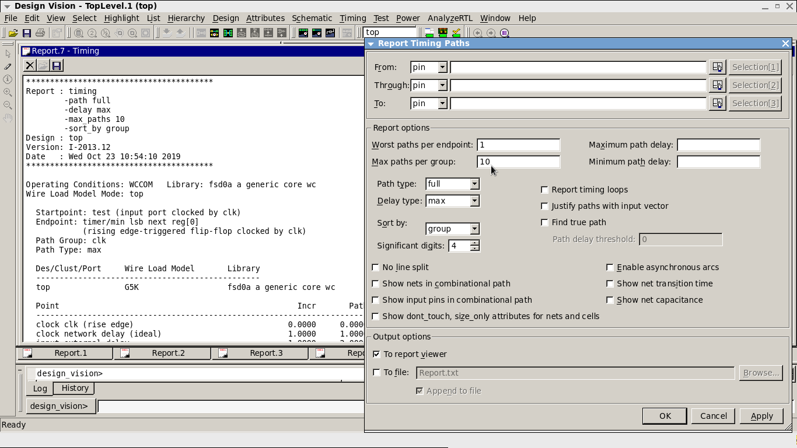

    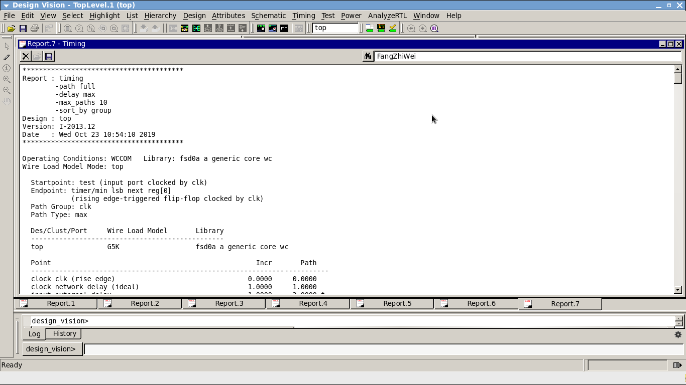

    

  

  * **标准报告**:  Design –>Report Design Hierarchy

  * **层次报告**:  Design -> Report Reference

  * **功率报告**:  Design -> Report Power

    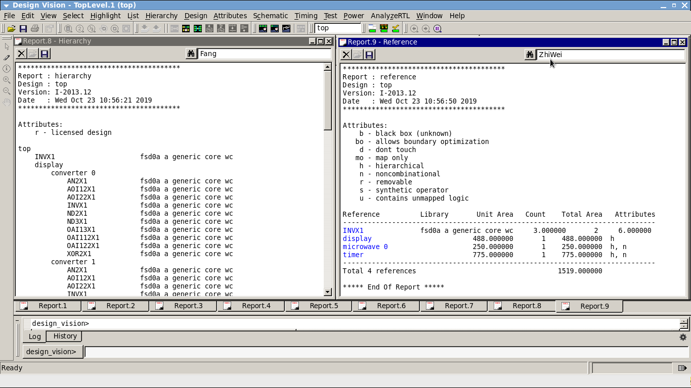

    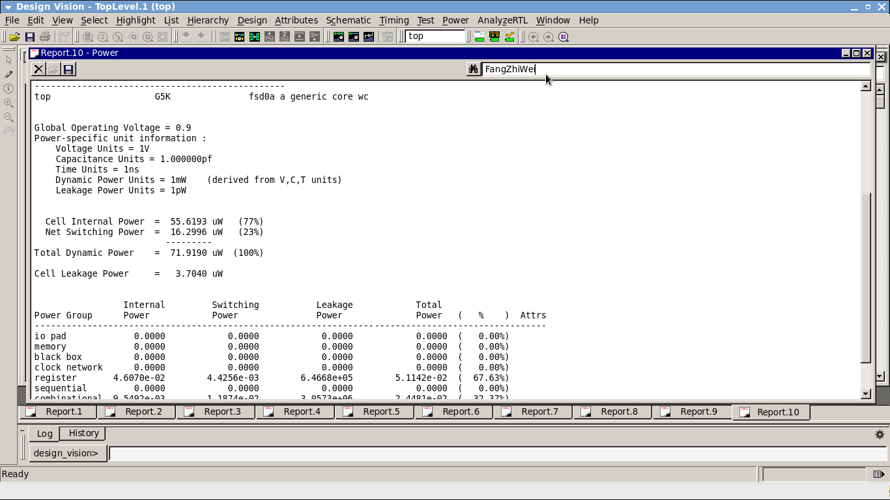


* 在 dv 中输入以下命令

  ~~~bash
  # 设定功率约束和门级功率优化
  set_max_total_power 0 uw
  compile -inc
  
  # 再次打印时间优化后的面积、时间、功率报告
  report_area
  report_timing
  report_power
  ~~~

  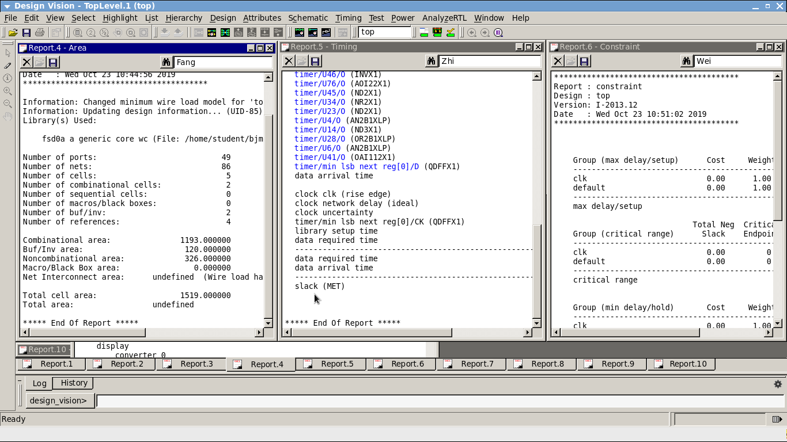


* 全面保存

  ~~~python
  # File -> save as
  top_compile.ddc
  
  # File -> save as
  top_compile.v
  
  # File -> save Info -> Design Timing
  top.sdf
  ~~~

  


### Lab 2-2 Leakage Power .Opt.by Multi-Vt

#### 一. 实验简述

通过乘法减少功率损耗，不知道干嘛的


#### 二. 操作流程

- 终端下：

  ```bash
  # 打开至lab2-2目录, 然后打印检查 .synopsys_dc.setup 的内容,不知道检查什么，也不知道干嘛的
  cat .synopsys_dc.setup
  
  # 打开Design Vision
  dv
  ```


- 在 dv 启动后，dv内进行以下操作

  ~~~bash
  # 直接读入命令脚本，进行各种花里胡哨操作，感觉其实 lab2-1 也可以这么做，真·浪费时间
  source script.tcl
  
  # 打印时间优化后的面积、时间、功率报告，截图
  report_area
  report_timing
  report_power
  ~~~

  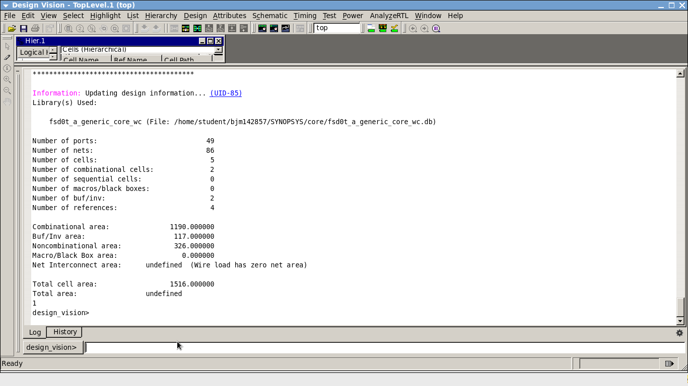

  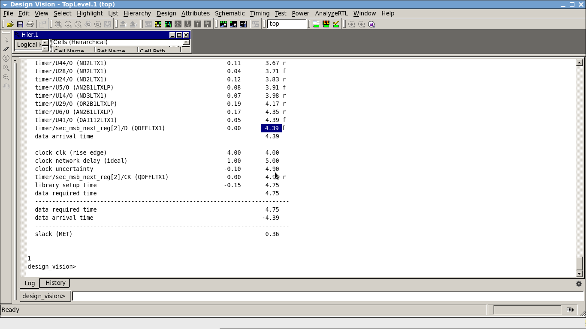

  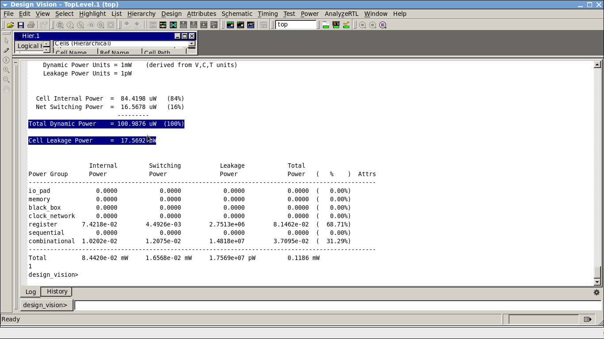


### Lab 2-3 DC-Topographical

#### 一. 实验简述

不知道干嘛的

#### 二. 操作流程

- 终端下：

  ```bash
  # 打开至lab2-3目录, 然后打印检查 .synopsys_dc.setup 的内容,不知道检查什么，也不知道干嘛的
  cat .synopsys_dc.setup
  
  # 打开Design Vision，这次要打开 DV opo 模式，好像很厉害的样子
  dv -topo
  ```


- 在 dv 启动后，dv内进行以下操作

  ~~~bash
  # 直接读入命令脚本，进行各种花里胡哨操作，脚本文件里最后的 -no_auto 还报错，要去掉
  # 另外这个compile_ultra运行时间贼久，等待期间可以先做下一个实验
  source script.tcl
  
  # 打印时间优化后的面积、时间、功率报告，截图
  report_area
  report_timing
  report_power
  ~~~

  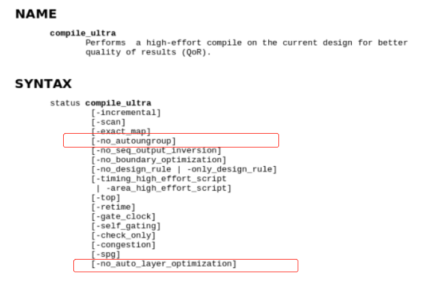

  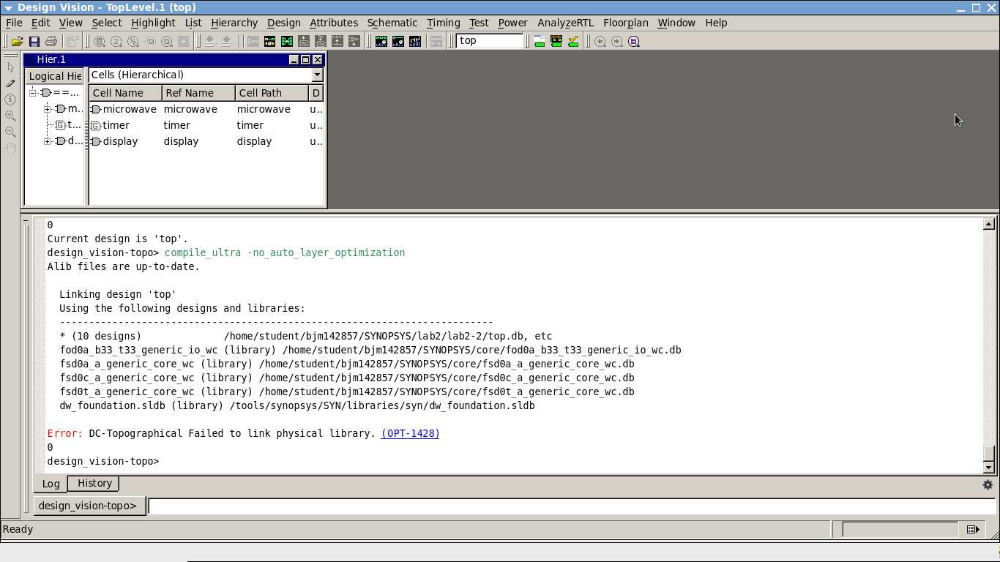


## Lab 3

### Lab 3-1: Top-level Synthesis

#### 一. 实验简述

不知道干嘛的

#### 二. 操作流程

- 终端下：

  ```bash
  # 打开至 lab3-1 > design 目录, 打印一遍 v 文件，随便看看
  cat CS.v
  cat CHIP.v
  
  # 返回至 lab3-1 > syn_dc 目录，里面的各种文件随便看一看
  ls					#　看看目录有多少个tcl文件
  cat xxx.tcl			# 逐个看看
  
  # 打开至 lab3-1 > syn_dc > run 目录，打开 dv 同时执行脚本，并重定向日志输出 run.log
  dv -f ../00_run.tcl | tee > run.log
  ```

  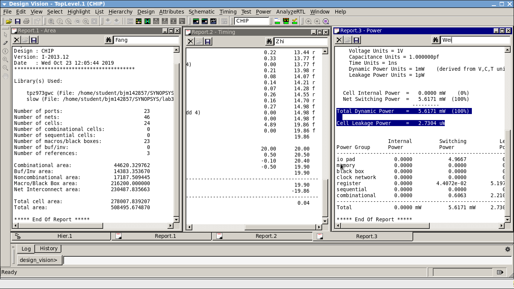

  

- 继续不知道弄个什么东西，它说是时序仿真，终端下：

  ~~~bash
  # 打开至 lab3-1 > tbench > presim 目录，创建软链接
  ln –s ../../syn_dc/run/cs_syn.vg
  ln –s ../../syn_dc/run/chip.sdf
  
  # 开始模拟综合结果，看到控制台打印出 "PASS" 字样即成功
  ncverilog testfixture.v cs_syn.vg -v ../tsmc18.v –v ../tpz973g.v +access+r
  ~~~

  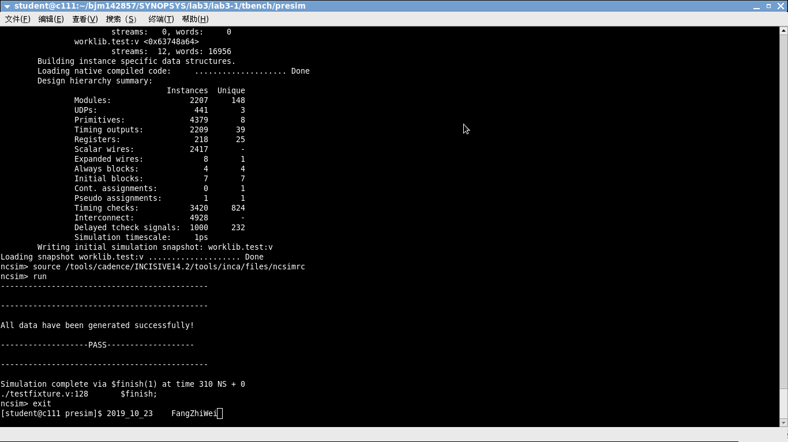


### Lab 3-2: CHIP-level Synthesis

#### 一. 实验简述

不知道干嘛的

#### 二. 操作流程

- 写芯片模块操作，终端下：

  ~~~bash
  # 题目说打开至 lab3-2 > syn_dc 目录, 打印一遍 v 文件，随便看看，可这个目录没有CHIP.v，CHIP.v 在 design 里
  cat ../design/CHIP.v
  
  # 打开至 lab3-2 > syn_dc > run 目录，进入 dv
  dv
  ~~~


* dv 控制台下，输入命令：

  ~~~bash
  # 执行脚本-贼慢
  source ../00_run.tcl
  ~~~

  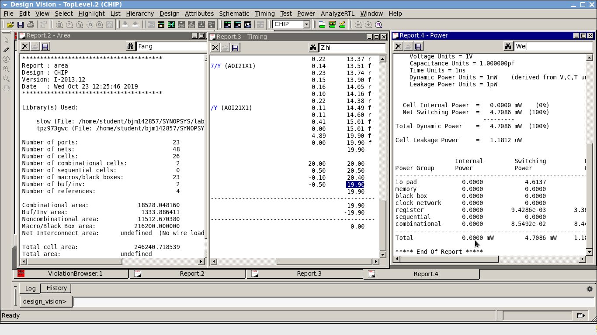

* 时序仿真，终端下：

  ~~~bash
  # 打开至 lab3-1 > tbench > presim 目录，创建软链接
  ln –s ../../syn_dc/run/cs_syn.vg
  ln –s ../../syn_dc/run/chip.sdf
  
  # 开始模拟综合结果，看到控制台打印出 "PASS" 字样即成功
  vcs testfixture.v cs_syn.vg -v ../tsmc18.v –v ../tpz973g.v
  ~~~

  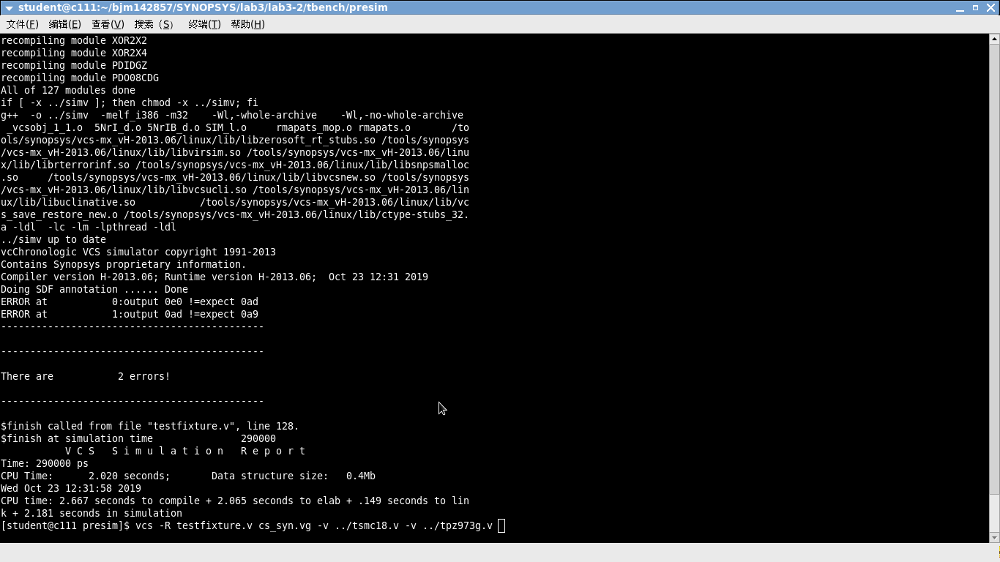

​		仿真运行后报错，说output不等于期望值，我也不知道是啥


### Lab 3-3: DC-Topographical

#### 一. 实验简述

不知道干嘛的

#### 二. 操作流程

- 写芯片模块操作，终端下：

  ```bash
  # 题目说打开至 lab3-3 > syn_dc 目录, 打印一遍 setup、tcl 文件
  cat run/.synopsys_dc.setup
  cat 01_import.tcl
  cat 02_compile.tcl
  
  # 打开至 lab3-2 > syn_dc > run 目录，进入 dv，同时执行脚本，并重定向日志输出 run.log
  dv -topo -f ../00_run.tcl | tee > run.log
  
  # 打印时间优化后的面积、时间、功率报告，截图
  report_area
  report_timing
  report_power
  ```

  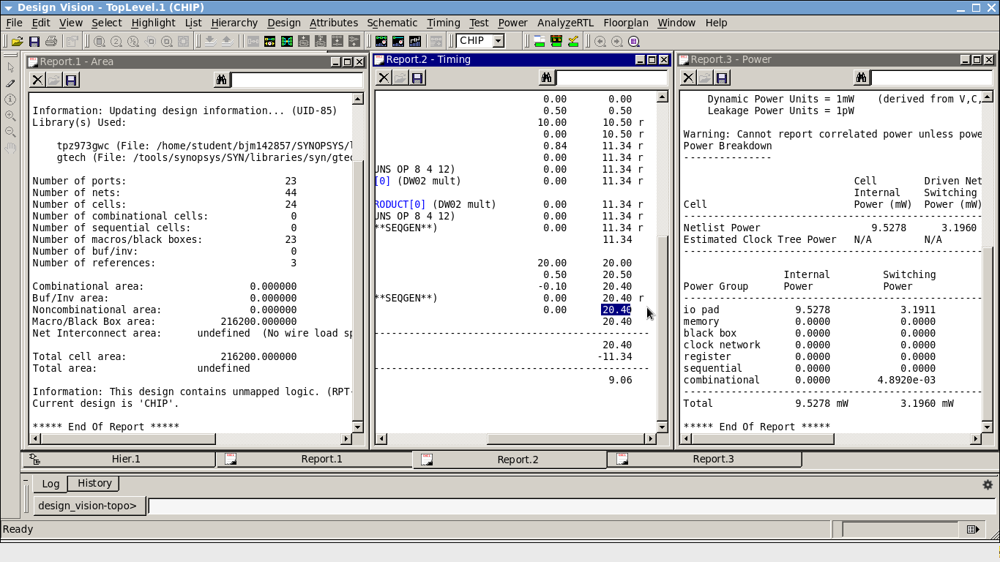


## Lab 4

### Lab 4-1: Register Retiming

#### 一. 实验简述

不知道干嘛的

#### 二. 操作流程

- 开始，终端下：

  ~~~bash
  # 打开至 lab4 目录，检查文件
  cat .synopsys_dc.setup
  
  # 打开dv
  dv
  ~~~

  

* dv控制台下

  ~~~bash
  # 点击 File > setup 检查路径(没问题)
  
  # 点击 File > Read
  读入 muldiv.v
  
  # 点击 File > Execute_script，超慢超慢
  执行 script.tcl
  
  # 打印时间优化后的面积、时间、功率报告，截图
  report_area
  report_timing
  report_power
  ~~~

  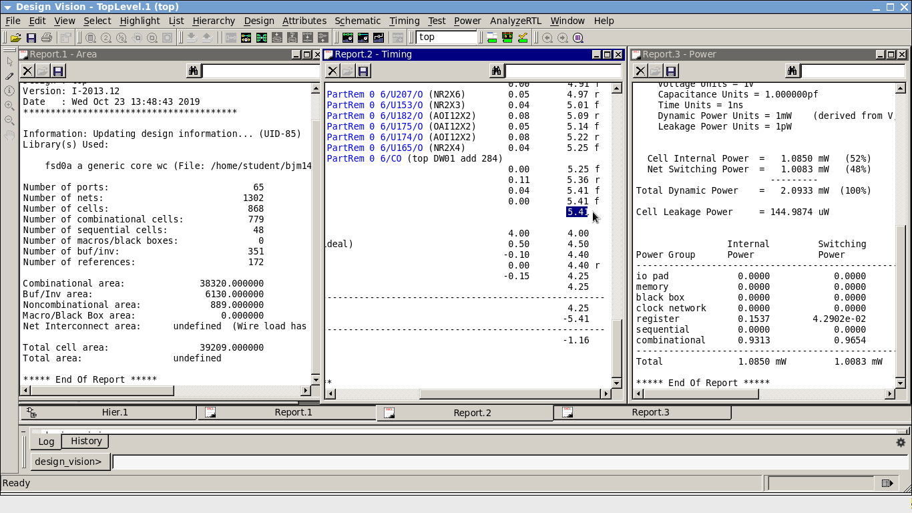

  

* 继续进行：

  ~~~bash
  # 选中 top，控制台输入
  remove_unconnected_ports -blast_buses [get_cells * -hier]
  
  ~~~

  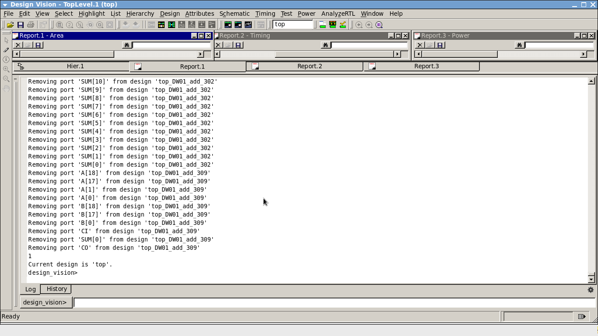

  

  ~~~bash
  # 先保存一下, File -> Save As
  muldiv_before_retiming.ddc
  Save All Designs in Hierarcjy
  
  # 看原理图，打印时间优化后的面积、时间、功率报告，截图
  report_area
  report_timing
  report_power
  ~~~

  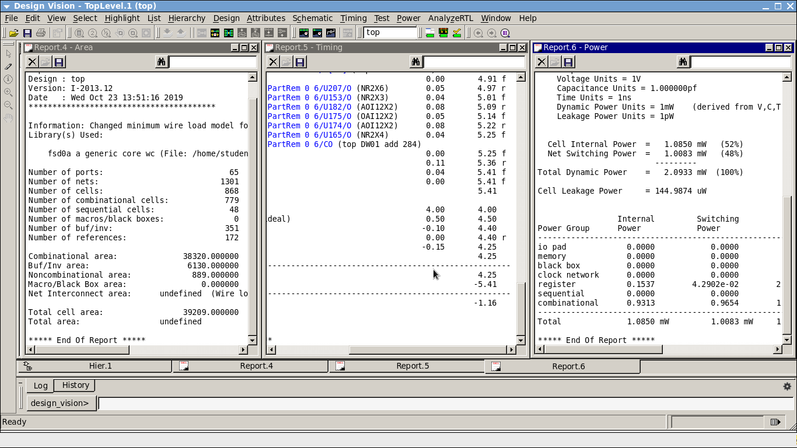

​	


### Lab 4-2: Pipeline Design

#### 一. 实验简述

不知道干嘛的

#### 二. 操作流程

- 在 4-1 的基础上进行：

  ```bash
  # File > Remove All Designs
  
  # File > Read
  读入 div.v
  
  # dv控制台输入以下指令
  
  ```

  